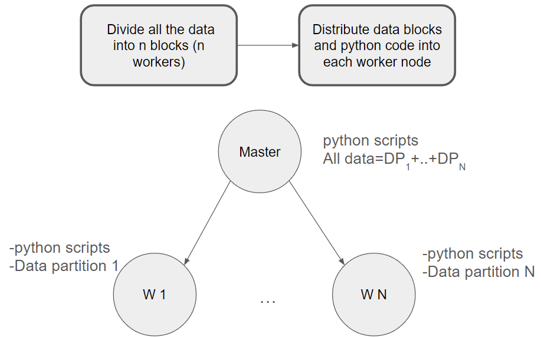
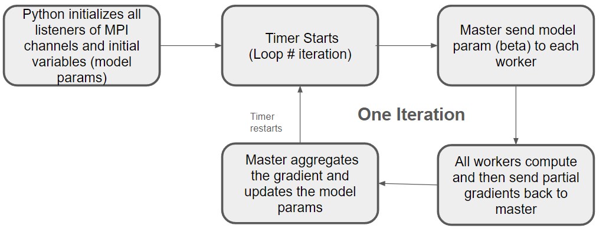

Experimental Setup
==================
In this project, we will conduct experiments similar to the [1]_ 's work. We will register multiple
AWS EC2 computation servers and create a cluster using MPI protocol with Python support.
The effect of our proposed gradient coding scheme (SPG) will be compared with baseline approaches.
Moreover we intend to build a universe automated simulation tool to help gradient coding researcher 
to try out their algorithms in real-life applications.

Cluster model
-------------
One image describing how the cluster looks is shown in the figure below:

We implemented all communication methods (send model parameters etc.) using
MPI4py [2]_ . It is a powerful python package that enable one to program MPI related function in python.
Based on the MPI protocol design, every worker node talks to the master node bidirectionally during 
the distributed learning. As the figure suggests, the master node would have complete data and python
program on itself, while worker nodes would only need it assigned data partitions and python program to 
run partial training.

Each iteration of training has the following process:

To recover Rashish's result with minimum deviation, our cluster adopts same type of server nodes, namely:
master - c5a.8xlarge and worker - t2.micro. We ran the various approaches to train logistic regression
models, a well-understood convex problem that is widely used in practice. Moreover, the usual one-hot 
encoding preprocessing happened in the logistic regression is a perfect method to guarantee that our 
experiment has reasonably computational complexity.

Python scripts explain
----------------------
Major scripts role explaination:

* **main.py**  
  The entry point to run various encoding schemes and tests.

* **src/arrange_real_data.py**  
  The script to setup data partitions based on user passed-in configurations.
  
* **src/naive.py**  
  The script to run uncoded distributed learning on each server node.

* **src/replication.py**  
  The script to run FRC scheme test with user specified number of stragglers.

* **src/coded.py**  
  The script to run CRC scheme test with user specified number of stragglers.

* **src/avoidstragg.py**  
  The script to run distributed learning test but ignore user specified number of stragglers during training.

* **src/bibd.py**  
  The script to run BIBD scheme test.

* **src/spg.py**  
  The script to run SPG scheme test.

Dataset and processing
----------------------

Choices of Evaluation
---------------------

.. References
.. ..........

.. [1] Tandon, R., Lei, Q., Dimakis, A. G., & Karampatziakis, N. (2016). Gradient coding. arXiv preprint 
   arXiv:1612.03301.
.. [2] Dalcin, Lisandro D., Paz, Rodrigo R., Kler, Pablo A., and
   Cosimo, Alejandro. Parallel distributed computing using
   python. Advances in Water Resources, 34(9):1124 – 1139,
   2011. New Computational Methods and Software Tools.