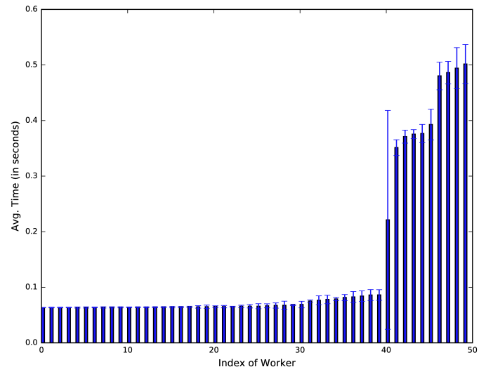

Gradient Coding
===============

In many Machine Learning applications nowadays, the size of training datasets
has grown significantly over the years to the point that it
is becoming crucial to implement learning algorithms in a
distributed fashion (federated learning) [1]_. Usually, the distributed learning is setup by creating a cluster
and the central node(or master node) will split the big dataset into multiple partitions. Then after central node broadcasting the data, 
each device trains the model on its assigned data partition and only shares the model updates (like gradients) with a central server. 
The server then aggregates these updates to improve the global model. One can see that this learning system would have advantageous 
training speed up over the traditional training under big dataset, since the pressure from training is splitted over
the cluster.

Motivation
----------
In practice the gains due to parallelization are often limited due to stragglers – workers
that are slowed down due to unpredictable factors such as network latency, cpu utilization or computational 
complexity etc. [2]_ [3]_ That's where it is contributing that Rashish and Qi brought up this creative idea to apply
a theoretic framework for mitigating stragglers in distributed learning. 

In the study [4]_, the authors have shown that the AWS EC2 machines could be as 10 times slower than normal case.
So it is necessary to implement some data recovery mechanisms during the distributed learning process.The straggler 
problem is even more daunting in massive-scale computing systems such as [5]_, which use AWS Lambda. Left untreated, 
stragglers severely impact latency, as the performance in each iteration is determined by the slowest machine.

Mechanisms [4]_
---------------
In Rashish's work, they focuses mainly on how to recover the returned partial gradients from each worker device. The problem
is generalized into two matrix: encoding matrix B and decoding matrix A. Imagine we have n workers and k data partitions:

.. math::

   AB = 1_{f \times k}

where f denotes the number of combinations of surviving workers/non-stragglers, :math:`1_{f \times k}` is the all 1s matrix of 
dimension :math:`f \times k`, and we have matrices :math:`A \in R^{f \times n}, B \in R^{n \times k}`.
We interpret the i-th row of B, :math:`bi`, to be the data assignment of worker i. The support of :math:`bi` corresponds
to the data partitions that the worker Wi has access to, and the entries of :math:`bi` encode a linear combination over 
their gradients that worker Wi transmits. Let :math:`g \in R^{k \times d}`, where d is the dimension of the gradient, be
a matrix with each row being the partial gradient of a data partition i.e.

.. math::

   \bar{g} = [g1,g2,...gk]^T

Then it's easy to see that the worker Wi transmits :math:`bi \bar{g}`. Notice that each worker computes a linear combination
of partital gradient and return it back to the master node. 

Since we have all possible decoding vectors stored as the rows in matrix A (Though it is more common to comput the
decoding vector in real-time). We can easily recover the full-gradient by doing dot product of decoding vector to the returned
gradients:

.. math::

   a_{i} B \bar{g} = [1,1,...,1] \bar{g} = (\sum_{i=1}^{k} g_{j})^T

Note for each iteration of training, only one decoding vector is needed as it is usually determined by the surviving
situation of the workers.

An example of encoding and decoding matrix for visually understanding:

.. math::
    A = \begin{pmatrix}
        0 & 1 & 2 \\
        1 & 0 & 1 \\
        2 & -1 & 0
        \end{pmatrix},
    and B = \begin{pmatrix}
            1/2 & 1 & 0 \\
            0 & 1 & -1 \\
            1/2 & 0 & 1
            \end{pmatrix},

It is easy for audience to check that :math:`AB=1_{3 \times 3}`. Since every row of A has exactly one zero, we say this
gradient coding scheme is robust to any one straggler.

Related Works
-------------

haha

.. References
.. ..........

.. [1] Li, L., Fan, Y., Tse, M., & Lin, K. Y. (2020). A review of applications in federated learning. 
   Computers & Industrial Engineering, 149, 106854.

.. [2] T. Hoefler, T. Schneider, and A. Lumsdaine, “Characterizing the influence of system noise on 
   large-scale applications by simulation,” in Proc.of the ACM/IEEE Int. Conf. for High Perf. Comp., Networking, Storage and Analysis, 2010, pp. 1–11.

.. [3] J. Dean and L. A. Barroso, “The tail at scale,” Commun. ACM, vol. 56, no. 2, pp. 74–80, Feb 2013.

.. [4] Tandon, R., Lei, Q., Dimakis, A. G., & Karampatziakis, N. (2016). Gradient coding. arXiv preprint 
   arXiv:1612.03301.

.. [5] E. Jonas, Q. Pu, S. Venkataraman, I. Stoica, and B. Recht, “Occupy the
   cloud: Distributed computing for the 99%,” in Proceedings of the 2017
   Symposium on Cloud Computing, ser. SoCC ’17, 2017, pp. 445–451.