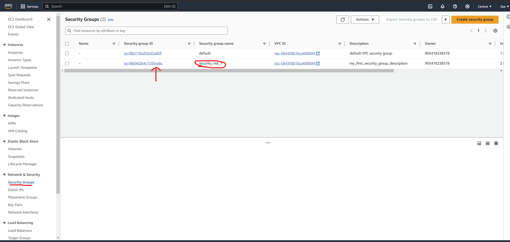

Run Simulation
==============

Step 1: Project Clone
---------------------

Firstly, we need to clone the project code into the cluster master node. After you ssh into the master server, run the following command:

.. code-block:: 

    git clone https://github.com/ZeeChono/gradient_coding_mds

Step 2: Project Configuration
-----------------------------

To make one's life easier, this project directory setup should follow as is shown in the screenshot below:
.. Add tree image

This project relies on the Makefile to build the project and start the simulation. There are several important parameters that the user 
should understand:
.. Add explaination of each param

Step 3: Run the simulation
--------------------------

1. Preprocess the dataset
2. Specify the dataset location, param correctly
3. Run the simulation, ensure that all workers are online.

.. code-block:: 

    make naive